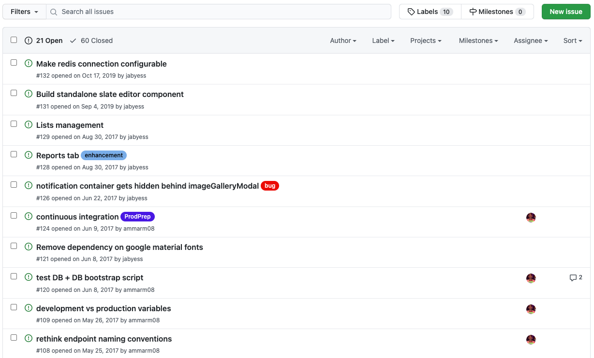

# Thinking in react - Github issues filter

Learning how to build apps in react is an important skill. Specifically, being able to look at a static mockup (or screenshot) and understand how to break it down into components.

Today we'll use one of the best pieces of technical literature I've ever read to learn how to understand how a react app comes together. Like many aspects of programming, this is a methodical and systematic way of approaching a problem. It is a process that can be learned and repeated.

There are no tests in this repo. The point is not to get tests to pass so you can get 100%. The point is to learn how to build something from scratch that has some ambiguity, and how to work within that unknown.

https://reactjs.org/docs/thinking-in-react.html

## Overview

We'll build a mock of a github issues page. The idea is to display a list of issues, and be able to type into the text input and search by title.

Look at the screenshot below (or look at any github repo that has issues on it) to get an idea of what we're going to be building.



We will start with an array of objects as input (see `apiResponse.js`). Pretend this array of objects is a JSON response from an API. Each item in the array represents an issue, and it's up to us to figure out how to render all this stuff on the page.

One object in the array might look something like this:

```js
{
  title: "Add async method to lesson",
  issue: 102,
  author: "jabyess",
  date: "Feb 1, 2021"
}
```

## Timeframe

For each section in the article, we will try to follow these guidelines. This includes reading & doing.

* **Step 1: Break The UI Into A Component Hierarchy** - 30 minutes, 10 minute review
* **Step 2: Build A Static Version in React** - 45 minutes, 10 minute review
* **Step 3: Identify The Minimal (but complete) Representation Of UI State** - 30 minutes, 15 minute review
* **Step 4: Identify Where Your State Should Live** - 30 minutes, 15 minute review
* **Step 5: Add Inverse Data Flow** - 2-4 hours - ? review

## Functional requirements

* Render a list of issues
  * Title
  * Issue #
  * Date
  * Author
* Render a text input
* When the input is empty, all issues should be displayed
* When something is typed in the input field, only render the issues that contain the text from the field. This should search by title.
  * Example: typing `notification` in the input field should only display issue #126 from the screenshot
  * Example: typing `de` should display #126, #121, #109
* Render the top bar above the issues
  * Top bar should include the number of issues currently being displayed

## Things to ignore

* Checkboxes next to the left of each issue
* The "filters" dropdown next to the input field
* Labels, milestones, New Issue button
* Any icons or logos
* Anything in the top bar other than the number of issues currently being displayed
* Badges/labels next to titles
* CSS - except for very basic things

## Bonus

* Add a new issue (with a totally separate form for inputting them)
* Add open/closed issue status and only display open ones.
  * You can add these manually in the `apiResponse` file
* Filter should work like the github issues filter now: typing in `is:open` or `is:closed` will filter by status. 

## Double bonus

* Add filtering by author: typing `author:myrasmith` should only show issues that were created by that author

## Triple bonus

* Combine multiple filtering methods - `is:open author:myrasmith` should show open issues that myra is the author of.